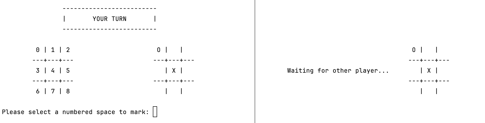
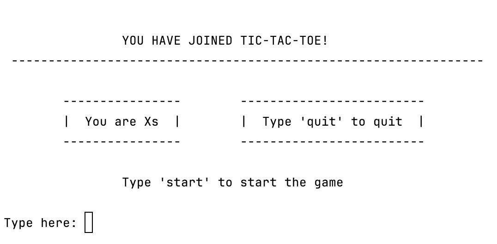

# Networked Tic-Tac-Toe Game
This project is a networked version of tic-tac-toe

### Features
- Gameplay over a TCP connection
- Terminal-based interface



# How to Play
Xs always go first, and this game is set up so that the person running the server code is Xs and the person running the client code is Os
- This can be changed by swapping `game = Game("O")` in line 18 of `server.py` with `game = Game("X")` in line 14 of `client.py`

### If playing locally:
1. Run `server.py` first
2. Run `client.py` in another terminal

### If playing over the network:

##### Setup
1. Change the `ip` variable at the top of `server.py` and `client.py` with the host's ip address
    ````python
    ip = '127.0.0.1'  # change this
    port = 8080
    ````
2. Make sure the other player has at least both `client.py` and `game.py`

##### Running the game
3. Run `server.py` first
4. Run `client.py` on another device


